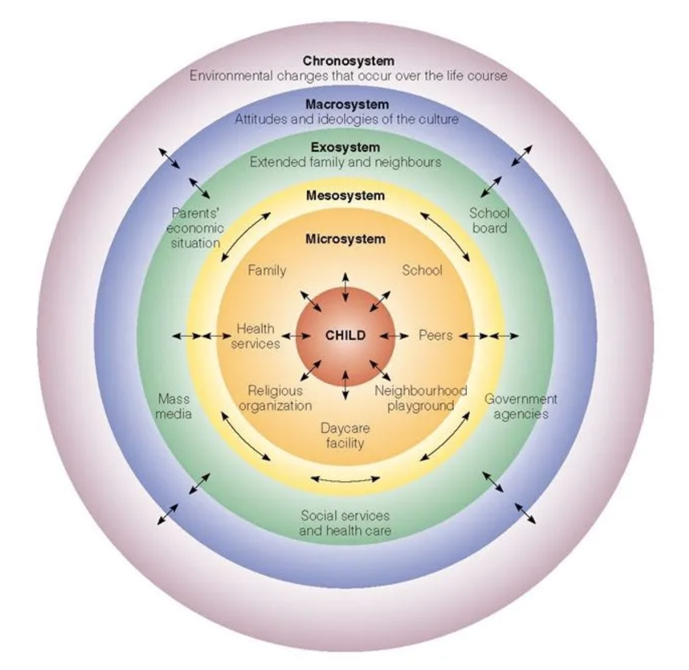

# Introduction 

## Introductary Quotes

MLK: "Injustice anywhere is a threat to justice everywhere. We are caught in an inescapable network of mutuality, tied in a single garment of destiny. Whatever affects one directly, affects all indirectly."
 

MLK: Barack Obama: "The arc of the moral universe is long, but it bends toward justice"

## Introduction to incarceration 

Example: Influential Findings

prisonpolicy.org
Million Dollar Block (Laura Kurgan)
Racial Bias in stop and frist (Jeff. Fagan and Andrew Gelman)

Change of perspective? Prisoners are no longer worthy of an investment. They can't be changed. They are serial criminals so there is no point in trying to rehabilitate.

This graph also shows where you need to target your focus. The majority of prisoners and the increase is particularly impactful at the state level. 

Prisons, especially in rural areas can represent a majority of a rural economy. How to interrupt that is a difficult question to answer but also plays a major role in the change of policy. 

### Million Dollar Block
Neighborhood or block with enough imprisoned residents that $1 million or more are being spent on prison costs

recitivism rate 70%. 

### Stop and Frisk

Blacks and Hispanics are stopped about twice as often as whites
Take into account of precinct variability in prior year's arrest
This data set also revealed unintended consequences of reducing school attendence for people of color. 

Whether levels of stop and frisk were increased or decreased. When violence went up, what happened? It seems that police were moved in, and then moved on relatively quickly. 

The goal was to stop guns and violence. What instead happened: (by combining 2 datasets, stop and frisk and scores on standardized testing). Schooling and education went down. 

Figure 1. Effect of Operation Impact on English Language Arts (ELA) Test Scores by Age for African American Boys

Personality Change: 
https://www.researchgate.net/publication/10751413_Development_of_Personality_in_Early_and_Middle_Adulthood_Set_Like_Plaster_or_Persistent_Change

Changes to the idea of the changes in personality. We have only recently began realizing that people's personalities can change. People become more consiencous as they get older. They become nicer more generative and more self aware. 

It is becoming clear that people are not fixed at the age of 18. Even personality orders show changing. 

Problematic behavior decreases over-time. 

Figure 2: 

It is certainly possible to change. The models that are used should be affected by this. 

## Mutlilevel Modeling 

2006 higher social class predicts lower suicide rate for White men but higher suicide rate for black men jackson and williams

There is importance in looking at different classes. Historically, we have had white researchers conduct a study on the majority and extrapolate that to the population. This of course is not always valid. 

Heterogeneity 
If you know all of your processes vary across all people and groups, well then you should never trust a single result and say it is applicable to the entire population. Do we have any reason to believe that is similar or identical to other groups that are not our sample. 

How do random effects cause problem? How does this limit our ability to expand the processes? 

ALthough the money is not always there, there is a new way of thinking towards the problem. There needs to be explanations of why is was constrained. Panels will have a larger difficulty accepting very small 
